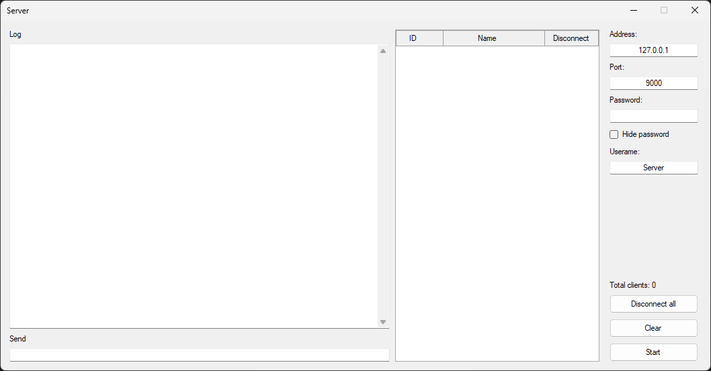
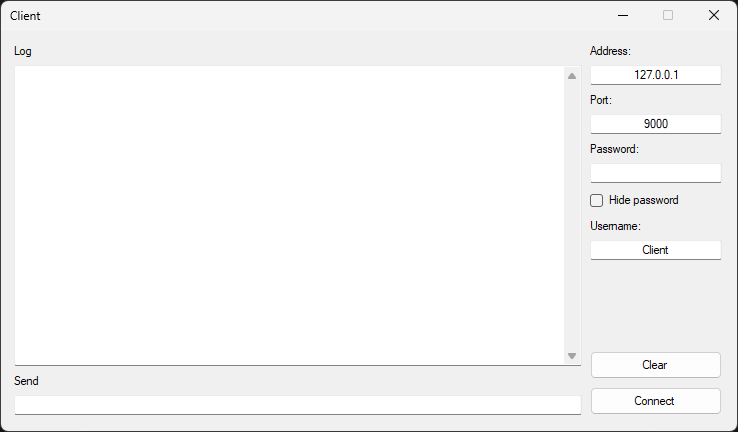

# tcp-chat-app

A simple C# chat application on the Windows Forms platform based on the TCP protocol.

## Server

All files related to the Server form are located in a directory named server.

## Client

All files related to the Client form are located in a directory named client.